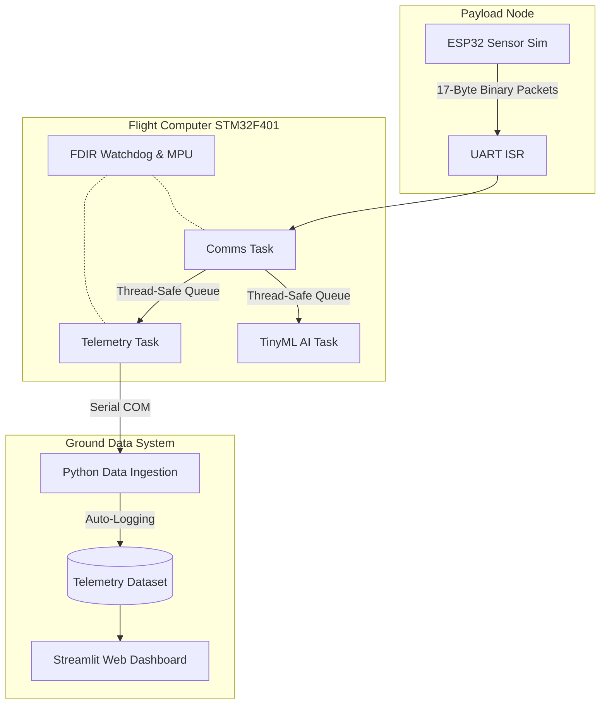

Here is a clean, professional, and highly aesthetic `README.md` designed specifically to catch the eye of engineering leads, aerospace startups, and research labs. It highlights your systems-level thinking, hardware-software integration, and modern tech stack.

Copy the raw text below and paste it directly into your `README.md` file in the root of your GitHub repository.

---

```markdown
# 🛰️ VELA Flight Software (v2.0)

[](#)
[](#)
[](#)
[](#)

A fault-tolerant, RTOS-based embedded flight software architecture designed to model modern spacecraft data systems. VELA bridges bare-metal C programming on ARM Cortex-M4 processors with a high-level Python Ground Data System (GDS), featuring hardware-level fault isolation, cryptographic command authentication, and Edge AI anomaly detection.

Designed to demonstrate production-ready aerospace engineering principles for startups, defense labs, and autonomous systems research.

---

## ⚙️ System Architecture & Data Flow

The system operates across two independent microcontrollers and a host machine, connected via UART and synchronized through a preemptive real-time operating system.



---

## ✦ Core Subsystems & Capabilities

* **Preemptive Multitasking (FreeRTOS):** Concurrent task execution managing communications, telemetry processing, and background AI inference without blocking.
* **FDIR & Hardware Fault Isolation:** An independent watchdog monitors thread starvation. The ARM Memory Protection Unit (MPU) locks critical SRAM zones, intercepting rogue pointers to trigger a hardware-level `MemManage` exception and an automated safe-mode reboot.
* **Space Cybersecurity (SpaceSec):** Implementation of a lightweight FNV-1a Hash-MAC cryptographic engine. All incoming uplink commands are verified against a pre-shared secret key to prevent RF command spoofing.
* **Edge AI (TinyML):** A bare-metal statistical anomaly detection model trained on historical telemetry. The AI continuously calculates Z-scores on live data streams, triggering hardware visual alarms if sensors deviate beyond a 3-sigma operational envelope.
* **Automated Data Dictionary:** NASA JPL-style YAML-to-C code generation (`dict_generator.py`) ensures zero mismatch between the flight computer's C-structs and the Python unpacking logic.
* **Live Mission Dashboard:** A real-time `Streamlit` web interface that ingests serial CSV logs to visualize thermal walks, radiation metrics, and orbital attitude dynamics.

---

## 📊 Visual Gallery

*(Insert screenshots and photos of your system in action here)*

| Mission Control Dashboard | Hardware Node Setup |
| --- | --- |
|  |  |
| *Real-time telemetry and AI anomaly alerts via Streamlit.* | *STM32 Black Pill (Flight PC) and ESP32 (Payload).* |

| Binary Packet Ingestion | FDIR Watchdog Recovery |
| --- | --- |
|  |  |
| *Python GDS unpacking little-endian C-structs.* | *Automated reboot sequence triggered by MPU fault.* |

---

## 🔌 Hardware Requirements

To replicate or deploy this project, the following hardware is required:

* **Flight Computer:** STM32F401CCU6 "Black Pill" (ARM Cortex-M4)
* **Payload Simulator:** ESP32 Development Board
* **Interface:** CP2102/FTDI USB to TTL UART Bridge
* **Wiring:** Standard Dupont jumper cables (Common Ground, TX/RX crossover)

---

## 💻 Installation & Quick Start

### 1. Software Prerequisites

* [STM32CubeIDE](https://www.st.com/en/development-tools/stm32cubeide.html) (For compiling and flashing the STM32)
* Arduino IDE or PlatformIO (For flashing the ESP32)
* Python 3.10+

### 2. Clone the Repository

```bash
git clone [https://github.com/yourusername/vela-flight.git](https://github.com/yourusername/vela-flight.git)
cd vela-flight

```

### 3. Flash the Hardware

1. Open `sim_node/` in Arduino IDE, select your ESP32 board, and upload.
2. Open the `flight_software/` folder as a workspace in STM32CubeIDE.
3. Build the project (Release or Debug) and flash it to the STM32 Black Pill via ST-Link or DFU.

### 4. Boot the Ground Data System (GDS)

Install the required Python data and UI libraries:

```bash
python -m pip install pyserial PyYAML pandas streamlit

```

**Terminal 1: Start Telemetry Ingestion**

```bash
python tools/ground_station.py
# Select the COM port connected to your STM32/ESP32 bridge.

```

**Terminal 2: Launch the Web Dashboard**

```bash
python -m streamlit run tools/web_dashboard.py

```

*The dashboard will automatically open in your default web browser at `http://localhost:8501`.*

Made by aman :)